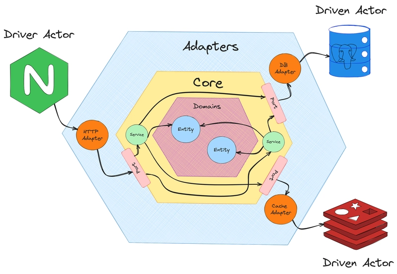

# Hexago

Go-based cryptocurrency trading system with gRPC API, using hexagonal architecture.

## 🚀 Quick Start

### Prerequisites
- Go 1.21+ 
- Protocol Buffers compiler (`protoc`)
- VS Code (recommended for development)

### Development Commands

```bash
# Install dependencies
go mod download

# Generate gRPC code (use VS Code task or manual command)
protoc --go_out=. --go-grpc_out=. api/backoffice/grpc/ohlc.proto

# Run unit tests
go test ./tests/unit/...

# Run integration tests  
go test ./tests/integration/...

# Run all tests
go test ./tests/...

# Run tests with race detection
go test -race ./tests/...

# Run tests with coverage
go test -coverprofile=coverage.out ./tests/...
go tool cover -html=coverage.out -o coverage.html
```

### VS Code Integration

This project includes VS Code tasks for:
- **Generate gRPC code from proto** - Use Ctrl+Shift+P → "Tasks: Run Task"

### Project Structure

```
├── api/                    # API definitions (proto files)
├── cmd/                    # Application entry points
├── internal/               # Private application code
│   ├── adapter/           # External integrations (ports & adapters)
│   ├── app/               # Application services  
│   ├── entity/            # Domain entities
│   ├── port/              # Port interfaces
│   └── service/           # Service implementations
├── pkg/                   # Public libraries
└── tests/                 # Test suites
    ├── integration/       # Integration tests
    └── unit/             # Unit tests
```

### Testing Strategy

- **Unit Tests** (`tests/unit/`) - Fast, isolated component testing
- **Integration Tests** (`tests/integration/`) - End-to-end gRPC API testing
- **GitHub Actions** - Automated testing on push/PR

### Architecture

This project follows **Hexagonal Architecture** (Ports & Adapters pattern), also known as the Clean Architecture approach. This architectural pattern allows us to isolate the core business logic from external concerns, making the system more testable, maintainable, and adaptable.



#### Key Components:

- **Domain Core** - Contains the business logic and domain entities
  - **Entities** (`internal/entity/`) - Domain models (OHLC, Tick, LP-Tick)
  - **Services** (`internal/service/`) - Core business logic implementations

- **Ports** (`internal/port/`) - Interfaces defining contracts between the core and external systems
  - Input ports (driving adapters): API endpoints, consumers
  - Output ports (driven adapters): databases, external APIs, publishers

- **Adapters** (`internal/adapter/`) - External integrations that implement the ports
  - **gRPC API** - RESTful API adapter for backoffice operations
  - **Binance** - Live price tick consumer from Binance WebSocket
  - **Redis** - Message broker and caching adapter
  - **MySQL** - Persistent storage adapter

- **Application Services** (`internal/app/`) - Orchestrate business workflows and coordinate between ports

This architecture ensures that:
- Business logic is independent of external frameworks and databases
- Easy to test with mock implementations
- External dependencies can be swapped without affecting the core
- Clear separation of concerns and single responsibility principle

## 📊 Coverage Reports

Test coverage reports are generated in GitHub Actions and can be viewed on [Codecov](https://codecov.io).

## 🔧 Development

### Running Locally
1. Generate gRPC code (VS Code task)
2. Run tests: `go test ./tests/...`
3. Start services as needed

### CI/CD
- Unit tests run on every push
- Integration tests run after unit tests pass
- Coverage reports uploaded to Codecov