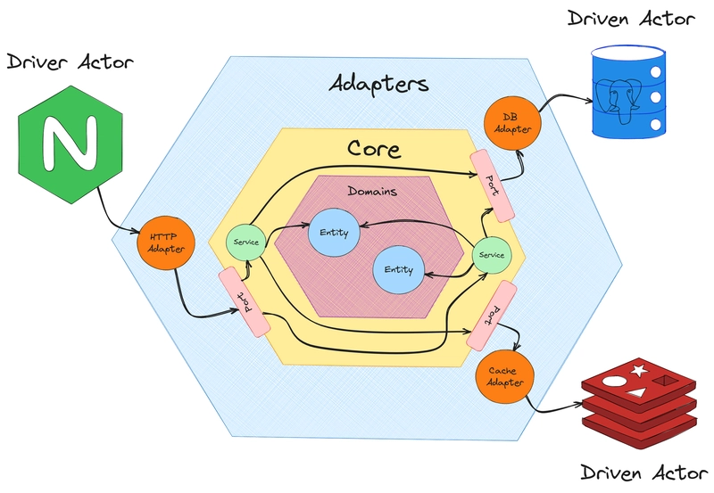

# Hexago - Hexagonal Architecture Go Template

🏗️ **Production-ready Go template** implementing **Hexagonal Architecture** (Ports & Adapters pattern)

This project serves as both a working cryptocurrency trading system and a **template for creating new Go applications** following clean architecture principles.

## 🎯 Template Features

- ✅ **Complete Hexagonal Architecture** implementation
- ✅ **Code generators** for adapters and services  
- ✅ **Comprehensive testing** strategy (unit + integration)
- ✅ **Docker & Docker Compose** support
- ✅ **VS Code integration** with tasks and settings
- ✅ **Automated workflows** with Makefiles and scripts
- ✅ **Production-ready logging** and error handling
- ✅ **gRPC API** with Protocol Buffers
- ✅ **Documentation** and best practices

## 🚀 Quick Start

### As a Template

```bash
# Create new project from template (cross-platform)
go run ./scripts/template-init

# Or manually clone and customize
git clone https://github.com/goregion/hexago my-project
cd my-project
# Update module paths and customize
```

### As Working Example

### Prerequisites
- Go 1.21+ 
- Protocol Buffers compiler (`protoc`)
- VS Code (recommended for development)

### Development Commands

```bash
# Setup development environment (installs tools and dependencies)
make setup-dev

# Install dependencies
make install

# Generate code (protobuf, mocks, etc.)
make generate

# Run unit tests
make test-unit

# Run integration tests  
make test-integration

# Run all tests
make test

# Run tests with race detection
make test-race

# Run tests with coverage
make test-coverage

# Format code
make fmt

# Run linter
make lint

# Build applications
make build

# Clean artifacts
make clean
```

## 🎨 Template Usage

### Generate New Components

```bash
# Create new adapter
make template-create-adapter
# Follow prompts to generate boilerplate

# Create new service
make template-create-service  
# Follow prompts to generate boilerplate
```

### Available Tools

- **`scripts/template-init/`** - Initialize new project from template (Go-based, cross-platform)
- **`scripts/create-adapter/`** - Generate new adapter boilerplate with ports
- **`scripts/create-service/`** - Create domain and application services with tests

### VS Code Integration

This project includes VS Code tasks and settings:
- **Generate gRPC code from proto** - Use Ctrl+Shift+P → "Tasks: Run Task"
- **Integrated terminal** configured for your platform
- **Go extension** settings optimized for hexagonal architecture

### Docker Support

```bash
# Development environment with external dependencies
make docker-up

# View logs
make docker-logs

# Stop services  
make docker-down
```

### Project Structure

```
├── api/                    # API definitions (proto files)
├── cmd/                    # Application entry points
├── internal/               # Private application code
│   ├── adapter/           # External integrations (ports & adapters)
│   ├── app/               # Application services  
│   ├── entity/            # Domain entities
│   ├── port/              # Port interfaces
│   └── service/           # Service implementations
├── pkg/                   # Public libraries
└── tests/                 # Test suites
    ├── integration/       # Integration tests
    └── unit/             # Unit tests
```

### Testing Strategy

- **Unit Tests** (`tests/unit/`) - Fast, isolated component testing
- **Integration Tests** (`tests/integration/`) - End-to-end gRPC API testing
- **GitHub Actions** - Automated testing on push/PR

### Architecture

This project follows **Hexagonal Architecture** (Ports & Adapters pattern), also known as the Clean Architecture approach. This architectural pattern allows us to isolate the core business logic from external concerns, making the system more testable, maintainable, and adaptable.



#### Key Components:

- **Domain Core** - Contains the business logic and domain entities
  - **Entities** (`internal/entity/`) - Domain models (OHLC, Tick, LP-Tick)
  - **Services** (`internal/service/`) - Core business logic implementations

- **Ports** (`internal/port/`) - Interfaces defining contracts between the core and external systems
  - Input ports (driving adapters): API endpoints, consumers
  - Output ports (driven adapters): databases, external APIs, publishers

- **Adapters** (`internal/adapter/`) - External integrations that implement the ports
  - **gRPC API** - RESTful API adapter for backoffice operations
  - **Binance** - Live price tick consumer from Binance WebSocket
  - **Redis** - Message broker and caching adapter
  - **MySQL** - Persistent storage adapter

- **Application Services** (`internal/app/`) - Orchestrate business workflows and coordinate between ports

This architecture ensures that:
- Business logic is independent of external frameworks and databases
- Easy to test with mock implementations
- External dependencies can be swapped without affecting the core
- Clear separation of concerns and single responsibility principle

## 📊 Coverage Reports

Test coverage reports are generated in GitHub Actions and can be viewed on [Codecov](https://codecov.io).

## 🔧 Development

### Running Locally
1. Generate gRPC code (VS Code task)
2. Run tests: `go test ./tests/...`
3. Start services as needed

### CI/CD
- Unit tests run on every push
- Integration tests run after unit tests pass
- Coverage reports uploaded to Codecov

## Todo checklist:
- [ ] Add migration scripts for database setup
- [ ] Add metrics and tracing
- [ ] Optimize performance for high-load scenarios

## 📚 Documentation

- **[Architecture Guide](docs/ARCHITECTURE.md)** - Detailed hexagonal architecture explanation
- **[Development Guide](docs/DEVELOPMENT.md)** - Setup and development workflows
- **[Testing Guide](docs/TESTING.md)** - Testing strategies and examples
- **[Task Documentation](doc/task.md)** - Original project requirements

## 🎯 Template Philosophy

This template demonstrates:

1. **Business Logic Isolation** - Core logic independent of external frameworks
2. **Dependency Inversion** - Dependencies flow inward to the core
3. **Testability** - Easy to test with mock implementations
4. **Flexibility** - Easy to swap adapters and add new interfaces
5. **Maintainability** - Clear separation of concerns and single responsibility

### Why Hexagonal Architecture?

- ✅ **Technology Independence** - Business logic not tied to specific databases or frameworks
- ✅ **Easy Testing** - Mock external dependencies for fast, reliable tests
- ✅ **Flexible Integration** - Add HTTP, gRPC, CLI interfaces without changing core logic
- ✅ **Future-Proof** - Easy to evolve and adapt to new requirements
- ✅ **Clear Boundaries** - Well-defined contracts between layers

## 🔧 Customization

When using as template:

1. **Update module path** in `go.mod`
2. **Replace imports** throughout codebase
3. **Customize entities** in `internal/entity/`
4. **Define your ports** in `internal/port/`
5. **Implement services** in `internal/service/`
6. **Create adapters** in `internal/adapter/`
7. **Wire everything** in `internal/app/`

## 🤝 Contributing

We welcome contributions! See [DEVELOPMENT.md](docs/DEVELOPMENT.md) for:

- Code style guidelines
- Testing requirements
- Pull request process
- Architecture decisions

## 📄 License

MIT License - feel free to use this template for your projects!