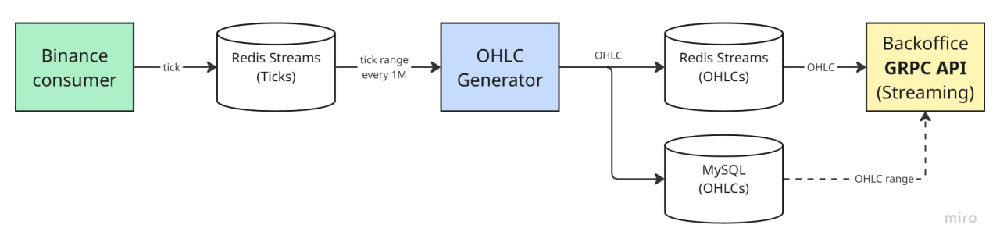

# 📈 Trading Chart Service

## 🎯 Project Overview

Develop a comprehensive trading chart service that processes real-time market data and provides OHLC candlestick aggregation capabilities.

### ⚡ Core Features

The service performs the following key functions:

1. **📊 Data Ingestion** - Reads tick data from live data streams
2. **🔄 Data Aggregation** - Converts tick data into OHLC Candlesticks
3. **📡 Real-time Broadcasting** - Streams current bar data via API
4. **💾 Data Persistence** - Stores completed bars in database

## 🏗️ System Architecture

The following diagram illustrates the overall system architecture and data flow:

---

## 🚀 Implementation Steps

### 1. 🔌 Binance API Integration

Connect to the Binance WebSocket API for real-time data:
- **Endpoint**: [Aggregate Trade Streams](https://developers.binance.com/docs/binance-spot-api-docs/web-socket-streams#aggregate-trade-streams)

### 2. 📋 Symbol Configuration

Fetch tick data for the following trading pairs:
- `BTCUSDT` 
- `ETHUSDT`
- `PEPEUSDT`

### 3. 📊 OHLC Aggregation

- **Timeframe**: 1 minute intervals
- **Assumption**: Server time synchronized with local time
- **Output**: OHLC Candlestick data structure

### 4. 🛠️ gRPC API Design

Design and implement a streaming gRPC server API for real-time data distribution.

### 5. 📡 Real-time Broadcasting

Broadcast bar updates on each incoming tick through the streaming API.

### 6. 🗃️ Database Storage

Persist completed bars to any SQL database of choice.

### 7. 🐳 Containerization

Package the entire service in a Docker container for easy deployment.---

## 📚 OHLC Candlestick Explanation

> **OHLC** stands for **Open, High, Low, Close** - a method of aggregating price data over time periods.

### 📈 Structure Example

For a **1-minute timeframe**, each candlestick contains:

| Field | Description | Example |
|-------|-------------|---------|
| **Timestamp** | Start of the time period | `2024-08-01T16:47:00` |
| **Open** | First tick price in the period | First trade price |
| **High** | Maximum price in the period | Highest trade price |
| **Low** | Minimum price in the period | Lowest trade price |
| **Close** | Last tick price in the period | Final trade price |

### 💡 Benefits

This structure efficiently compresses any number of individual ticks into:
- **1** integer (timestamp)
- **4** floating-point numbers (OHLC prices)

This provides an optimal balance between data compression and historical price representation.

---

### 🔧 Technical Stack

- **Language**: Go
- **API Protocol**: gRPC
- **Database**: SQL (configurable)
- **Containerization**: Docker
- **External API**: Binance WebSocket

